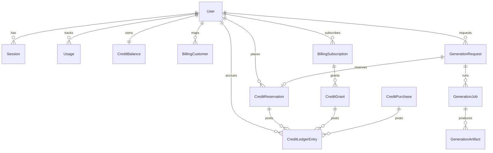

# نموذج البيانات المقترح (قبل SQL)

## مبادئ التصميم (MVP نظيف وقابل للتوسع)

- **أقل عدد جداول ممكن**: لا نضيف جدولًا إلا إذا كان يحل مشكلة واضحة (idempotency، تدقيق، async lifecycle).
- **مصدر حقيقة واحد لكل نطاق**:
  - **Credits**: `CreditBalance` للقراءة السريعة + `CreditLedgerEntry` للتدقيق (اختياري لكن أوصي به لأنه يمنع “سحر” تغيّر الرصيد بلا أثر).
  - **Generations**: `GenerationRequest` ككيان أعمال + `GenerationJob` كتنفيذ + `GenerationArtifact` كمخرجات.
- **تسمية متسقة**: PascalCase للنماذج، وحقول قياسية: `id`, `userId`, `status`, `createdAt`, `updatedAt`, و`externalId` للمزوّد.
- **مزود فوترة/توليد محايد**: حقول `provider` + `externalId` بدل جداول متخصصة لكل مزود.
- **جداول “لاحقًا” تكون فعلاً لاحقًا**: نحددها صراحة ولا ندخلها في MVP SQL.

## افتراضات ثابتة (حسب إجاباتك + ما وجدته في المشروع)

- **الفوترة**: مزود غير محدد/"Other" ⇒ نصمم جداول **مزود-محايدة** مع `provider` و`externalId`.
- **مصادر الأرصدة**: **اشتراك + شحنات (Top-ups)**.
- **الحسابات**: **أفراد فقط** (لا Teams/Workspaces الآن).
- **التوليد**: **مهام غير متزامنة** (Queued/Running/Succeeded/Failed) مع إمكانية Polling/Webhook.
- يوجد حالياً Prisma schema يضم: `User`, `Subscription`, `CreditBalance`, `CreditReservation`, `Usage`, `Session` في `[prisma/schema.prisma](prisma/schema.prisma)`.

## 1) قائمة الكيانات (الجداول) المقترحة

### نطاق الهوية/الدخول

- `User`
- `Session`

### نطاق الأرصدة والائتمان (Credits)

- `CreditBalance` (الرصيد الحالي — موجود)
- `CreditReservation` (حجز/hold — موجود)
- `CreditLedgerEntry` (دفتر أستاذ/حركة أرصدة قابلة للتدقيق) **موصى به**

### نطاق الفوترة (MVP provider-agnostic)

- `BillingCustomer` (ربط المستخدم بالمزوّد: `provider`, `externalCustomerId`)
- `BillingSubscription` (نسخة داخلية لحالة الاشتراك: `provider`, `externalSubscriptionId`, `status`, `currentPeriodStart/End`, `planCode`)
- `BillingWebhookEvent` (لتتبع + idempotency عند استقبال webhooks)
- `CreditGrant` (منح شهري من الاشتراك)
- `CreditPurchase` (Top-up)

### نطاق القياس (Usage quotas)

- `Usage` (requests/images per period — موجود)

### نطاق التوليد (Generation lifecycle)

- `GenerationRequest` (كيان منطقي لطلب المستخدم: prompts/batch/remove-bg/package)
- `GenerationJob` (تنفيذ فعلي على مزود خارجي/داخلي — حالة وتشغيل)
- `GenerationArtifact` (مخرجات: صور، HTML، CSS، zip/single-file، metadata)
- (لا نضيف `GenerationStep`/`GenerationError` في MVP — يمكن توسيع `GenerationJob` لاحقًا)

## 2) العلاقات بين الجداول (Relationships)

### ملاحظات تصميمية للعلاقات

- `BillingCustomer` و`BillingSubscription` قد يكونان 0..N لأن المستخدم قد يبدّل مزوداً مستقبلاً أو يُعاد ربطه.
- `GenerationRequest` قد يملك **حجز رصيد واحد** (لعملية واحدة) أو عدة حجوزات إذا كانت العملية مركبة؛ كبداية: واحد لكل طلب API.
- `CreditLedgerEntry` هو المصدر القابل للتدقيق لكل تغيير رصيد؛ و`CreditBalance` مجرد **مخزن مُشتق/سريع**.

## 3) مسؤوليات كل جدول (Responsibilities)

### `User`

- الهوية الداخلية للمستخدم وPlan الحالي (أو plan من خلال اشتراك).

### `Session`

- جلسات API (token + expiry) — موجود.

### `Usage`

- عدادات quota شهرية/دورية (requests/images) — موجود.

### `Plan` / `PlanEntitlement`

- **MVP**: يمكن إبقاء `Plan` كـ enum داخل `User`/`Subscription` كما هو الآن.\n+- **لاحقًا**: إن احتجت إدارة خطط من لوحة تحكم أو تجارب/Flags، نضيف `Plan`/`PlanEntitlement`.

### `BillingCustomer`

- ربط المستخدم مع كيان العميل لدى مزود الفوترة: `provider`, `externalCustomerId`, `email`, `createdAt`.

### `BillingSubscription`

- نسخة داخلية لحالة اشتراك المزود: `provider`, `externalSubscriptionId`, `status`, `currentPeriodStart/End`, `cancelAtPeriodEnd`, `planCode`.
- تستخدم لتحديد منح الأرصدة الدورية.

### `BillingWebhookEvent`

- تخزين webhook payload/headers + `providerEventId` + حالة المعالجة.
- هدفها: **Idempotency** (منع تكرار تطبيق نفس الحدث) + تتبع.

### `BillingInvoice` / `BillingPayment` (اختياري)

- **ليس ضمن MVP**. نضيفه فقط إذا احتجت تقارير مالية/مطابقة دقيقة أو تدقيق متقدم.

### `CreditBalance`

- الرصيد الحالي لكل مستخدم — موجود.

### `CreditReservation`

- حجز أرصدة قبل تنفيذ العملية (`PENDING`, `FINALIZED`, `ROLLED_BACK`) مع `expiresAt` — موجود.

### `CreditLedgerEntry`

- سجل محاسبي لكل حركة أرصدة (مهم لتجنب التعقيد لاحقًا عند الدعم/النزاعات):
  - `direction`: CREDIT/DEBIT
  - `amount`
  - `reason`: `reservation_hold`, `reservation_finalize`, `reservation_rollback`, `subscription_grant`, `topup_purchase`, `manual_adjustment`
  - مراجع: `reservationId`, `grantId`, `purchaseId`, `generationRequestId`
  - `idempotencyKey`

### `CreditGrant`

- تمثيل منح أرصدة: من اشتراك شهري أو منحة يدوية.
- يربط بـ `BillingSubscription` أو `Plan` وبـ `periodKey` لمنع ازدواج المنح.

### `CreditPurchase`

- تمثيل شراء أرصدة (Top-up): مبلغ، عملة، كمية credits، حالة (PENDING/PAID/REFUNDED).
- يربط بفواتير/دفعات مزود الفوترة عند توفرها.

### `GenerationRequest`

- سجل “النية” من طرف المستخدم لعملية محددة:
  - `operation` (generate_prompts/generate_batch/remove_background/package_result)
  - input payload (منظّم أو JSON)
  - `status` (CREATED/QUEUED/RUNNING/SUCCEEDED/FAILED/CANCELLED)
  - `userId`
  - `creditReservationId` (إن وُجد)
  - `idempotencyKey` لطلبات API المعاد إرسالها

### `GenerationJob`

- تمثيل تنفيذ فعلي (قد يكون أكثر من Job لكل Request):
  - `provider` (replicate/gemini/internal…)
  - `externalJobId`
  - `status`, `startedAt`, `finishedAt`, `attempt`, `lastHeartbeatAt`
  - `costMetrics` (tokens/seconds/images) لتقارير تكلفة لاحقة

### `GenerationArtifact`

- تخزين مخرجات قابلة للاستهلاك:
  - `kind` (image, html, css, json, zip, single_file_html)
  - `storage` (url/blob key/base64 ref)
  - `metadata` (role, aspect_ratio, promptRole, dimensions)

## 4) كيف يعمل تدفق الأرصدة (Reserve / Consume / Rollback)

### الهدف

- ضمان ألا يبدأ تنفيذ عملية مكلفة دون ضمان توفر رصيد.
- ضمان قابلية التتبع والمراجعة.

### التدفق المقترح (يتوافق مع منطقك الحالي في `lib/credits/`*)

- **Reserve (حجز)**
  - إنشاء `CreditReservation(PENDING, amount, expiresAt)`
  - تحديث `CreditBalance` فوراً (خصم amount) لتجنب overspend
  - إضافة `CreditLedgerEntry` من نوع `reservation_hold` (DEBIT)
- **Consume/Finalize (تثبيت الاستهلاك)**
  - عند نجاح العملية: تحديث `CreditReservation` إلى `FINALIZED`
  - إضافة `CreditLedgerEntry` من نوع `reservation_finalize` (قد يكون 0 إن كنت تعتبر hold هو الخصم النهائي؛ أو Entry توثيقي بقيمة 0)
- **Rollback (تراجع)**
  - عند فشل العملية: تحديث `CreditReservation` إلى `ROLLED_BACK`
  - إعادة amount إلى `CreditBalance`
  - إضافة `CreditLedgerEntry` من نوع `reservation_rollback` (CREDIT)
- **Expiry safety net (مهم مع async)**
  - مهمة خلفية/cron تفحص `CreditReservation` المنتهية `expiresAt` وهي `PENDING` وتقوم بعمل rollback تلقائي.

### قرار تصميم مهم

- لأنك بالفعل تخصم من `CreditBalance` وقت الحجز، فـ **finalize** لا يغير الرصيد؛ دوره “إقفال” الحجز.
- `CreditLedgerEntry` هو ما يعطيك trace كامل حتى لو تغيّر منطق الخصم لاحقاً.

## 5) كيف نخزن دورة حياة التوليد (Generation lifecycle)

### لماذا نحتاج `GenerationRequest/Job/Artifact`

- لدعم async jobs، polling، retries، وربط النتائج بالمستخدم والرصيد.

### حالة نموذجية

- API يستقبل طلب → ينشئ `GenerationRequest(CREATED)`
- يحجز رصيد → يربط `creditReservationId`
- يضع الطلب في التنفيذ → `GenerationRequest(QUEUED)`
- ينشئ `GenerationJob` للمزوّد الخارجي مع `externalJobId`
- عند التحديثات: تحديث حالة `GenerationJob` وتزامن حالة `GenerationRequest`
- عند النجاح:
  - إنشاء `GenerationArtifact` (صور/HTML/metadata)
  - `finalizeCredits(reservationId)`
  - `GenerationRequest(SUCCEEDED)`
- عند الفشل:
  - تسجيل error
  - `rollbackCredits(reservationId)`
  - `GenerationRequest(FAILED)`

### idempotency

- `GenerationRequest.idempotencyKey` يمنع تكرار الحجز/التنفيذ عند إعادة إرسال نفس الطلب.

## 6) كيف تتفاعل الاشتراكات والفوترة مع الأرصدة

### الاشتراك → منح أرصدة دورية

- عند حدث تجديد/بدء فترة جديدة في `BillingSubscription`:
  - إنشاء `CreditGrant` لـ `userId + subscriptionId + periodKey` (Unique)
  - إضافة `CreditLedgerEntry(subscription_grant, CREDIT, amount)`
  - تحديث `CreditBalance` بزيادة amount

### Top-ups

- إنشاء `CreditPurchase(PENDING)` عند بدء الدفع
- عند تأكيد الدفع (Webhook أو Poll):
  - تحديث `CreditPurchase(PAID)`
  - إضافة `CreditLedgerEntry(topup_purchase, CREDIT, amount)`
  - تحديث `CreditBalance`
- عند Refund:
  - `CreditLedgerEntry` عكسي (DEBIT) وفق سياسة المنتج (قد تمنع refund إذا استُهلكت الأرصدة)

### Idempotency للفوترة

- `BillingWebhookEvent` يخزن `providerEventId` ويُعلّم processed لمنع تكرار منح الأرصدة.

## مخرجات هذه المرحلة (بدون SQL)

- مواصفات كل جدول (الأعمدة الرئيسية + المفاتيح الفريدة + الفهارس المقترحة)
- مخطط علاقات (ER)
- تدفق الأرصدة والتوليد والفوترة

## ما سأفعله لاحقاً عند الانتقال لمرحلة SQL (ليس الآن)

- ترجمة هذا النموذج إلى Prisma models + migrations Postgres
- إضافة قيود uniqueness/idempotency + فهارس الحالات
- إضافة cron/worker لمنتهيات الحجوزات + معالجة webhooks

